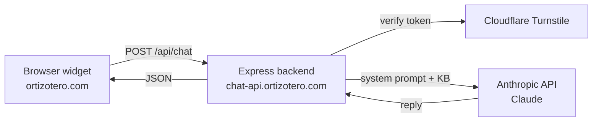

# CV Q&A Agent

A conversational agent embedded on [ortizotero.com](https://ortizotero.com) that answers questions about my professional background — built and deployed as a real production system, not a notebook demo.

**[Try it live →](https://ortizotero.com)**

## Why this exists

A CV is static and gets skimmed in 30 seconds. This lets a recruiter or hiring manager ask what they actually care about ("what did you do at MSCI?", "how do you use AI in your work?") and get a grounded answer — while doubling as proof of hands-on system design: containerized deployment, DNS, TLS, anti-bot protection, and CORS, all wired together and running live.

## Architecture



- **Frontend**: a single static `index.html` — no framework, no build step. Calls the backend directly from the browser.
- **Backend**: Node/Express API, stateless (conversation history is passed by the client on each request, not stored server-side). Containerized with Docker, deployed behind Traefik/Coolify on its own subdomain.
- **Knowledge**: the system prompt and the CV knowledge base are plain markdown files loaded at boot (`content/`) — editing what the agent knows means editing markdown, not code.

## Stack

| Layer | Choice |
|---|---|
| Backend | Node.js, Express |
| LLM | Claude (`@anthropic-ai/sdk`), model configurable via `CLAUDE_MODEL` |
| Anti-bot | Cloudflare Turnstile (invisible mode) |
| Rate limiting | `express-rate-limit` — 20 messages/hour per IP |
| Deployment | Docker (`node:20-alpine`) behind Traefik/Coolify |
| Analytics | GTM → GA4, custom `conversation_started` event |
| Frontend | Vanilla HTML/CSS/JS, bilingual (EN/ES) |

## Security & production practices

- Fails fast on boot if `ANTHROPIC_API_KEY` or `TURNSTILE_SECRET_KEY` are missing — never runs half-configured.
- Every message is verified server-side against Turnstile before it reaches the model; no way to skip it from the client.
- Input is bounded: message length, history length, and JSON payload size are all capped to limit abuse surface.
- CORS is locked to a single allowed origin; the API isn't a general-purpose open endpoint.
- `trust proxy` is explicitly set for correct client-IP resolution behind Traefik/Coolify (rate limiting depends on this being right).
- Frontend distinguishes error types (rate-limited, verification failed, invalid input, network/server error) instead of one generic failure message, and retries once automatically on transient network/5xx failures.

## Project structure

```
cv-qa-agent/
├── backend/
│   ├── server.js              # Express app, /api/chat, /health
│   ├── validation.js          # pure input-validation helpers (unit tested)
│   ├── content/
│   │   ├── system-prompt.md   # agent persona, tone, guardrails
│   │   └── alex-cv-knowledge-base.md
│   ├── Dockerfile
│   └── .env.example
└── frontend/
    └── index.html             # chat widget, calls the backend directly
```

## Running locally

```bash
cd backend
cp .env.example .env   # fill in ANTHROPIC_API_KEY and TURNSTILE_SECRET_KEY
npm install
npm run dev
```

Then open `frontend/index.html` directly, or serve it (`python -m http.server`) and point `API_URL` in the script tag at your local backend.

## Tests

```bash
cd backend
npm test
```

## License

MIT — see [LICENSE](LICENSE).

---

Built by [Alejandro Ortiz Otero](https://www.linkedin.com/in/alejandroortizotero/).
